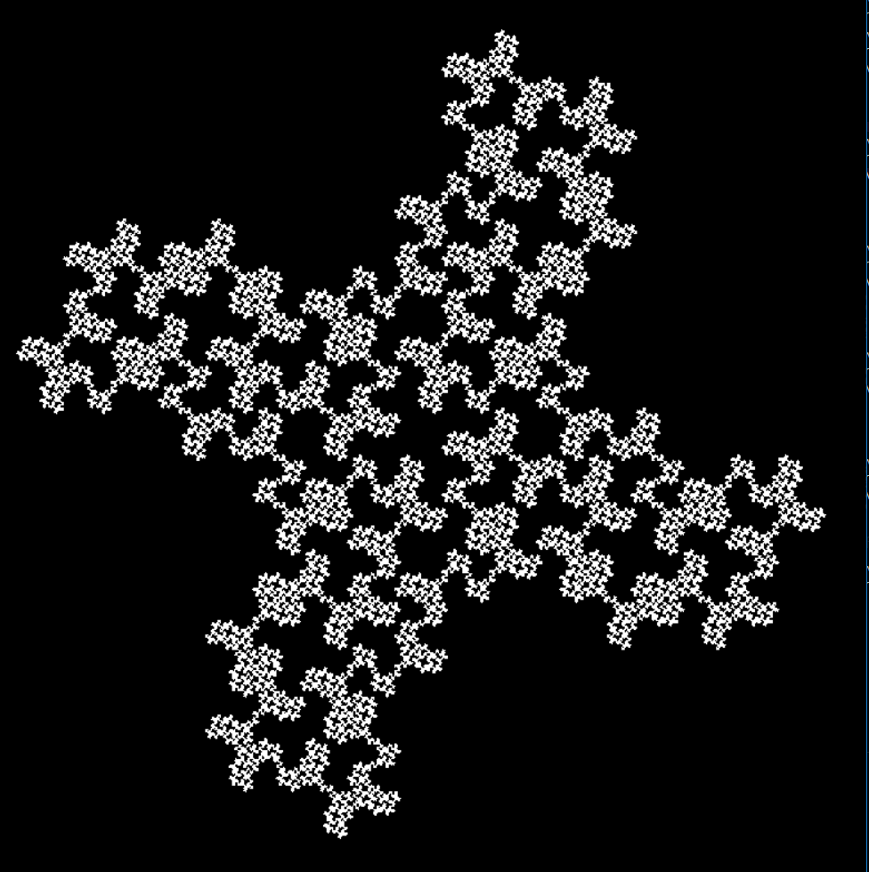



# L-systems in Turtle Graphics and Haskell

### Examples of designs that can be generated:

More designs are <a href="https://github.com/GaganSD/Fractal-Generator-with-Haskell/tree/master/designs-produced-using-haskell">here</a>

### Getting started:

The Swedish biologist Aristid Lindenmayer developed L-Systems to model the development of plants. An L-System consists of a start pattern and a set of rewrite rules which are recursively applied to the pattern to produce further increasingly complex patterns.

## Prerequisites:

To produce the results of my code you need to have Haskell and Turtle Graphics installed in your PC.
- You can install Haskell from here: https://www.haskell.org/downloads
Then, you can install turtle graphics by:
	- Opening you terminal and updating the cabal database. You can do that by typing 
	- ``cabal update``
- Once it's updated, you can type:
-  	``cabal install GLUT``
- Download the code from Github, load it and you'll can type 
- ``display ( {design of your choice} {depth of the fractal. Integer value}).``

## Author:
 - Gagan Devagiri

## License:
- MIT License

