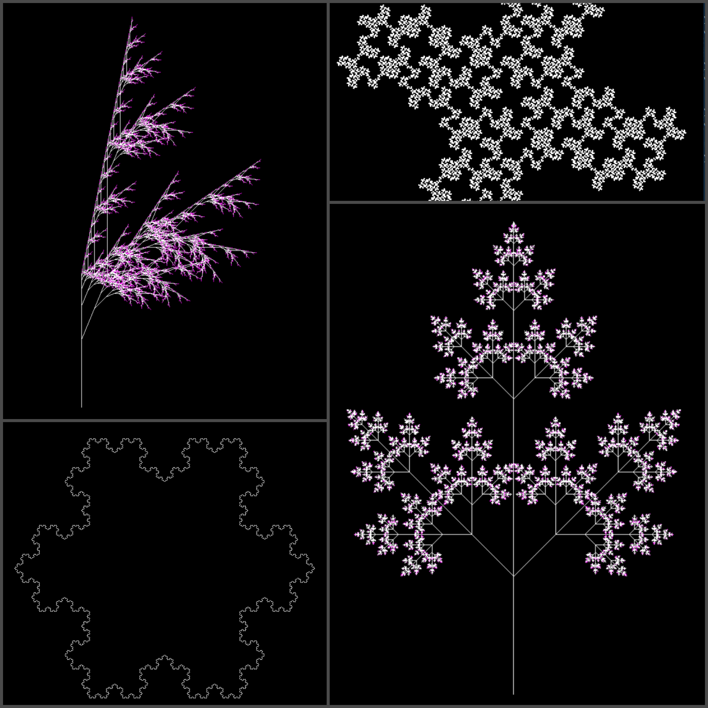

# Fractal Generator

### Examples of Fractals generated

### Background:

A fractal is a pattern built from simple repeated shapes that are reduced in size every time they are repeated. Here we used L-Systems techniques to generate fractals in Haskell.

## Getting Started:

- Install Haskell and [GLUT](https://hackage.haskell.org/package/GLUT) 
- Clone the repository and load ``examples.hs`` and ``LSystems.hs``
- ``display $ {design of your choice} {depth of the fractal. Integer value}``

## License:
[MIT](https://github.com/GaganSD/Fractal-Generator) © Gagan Devagiri
